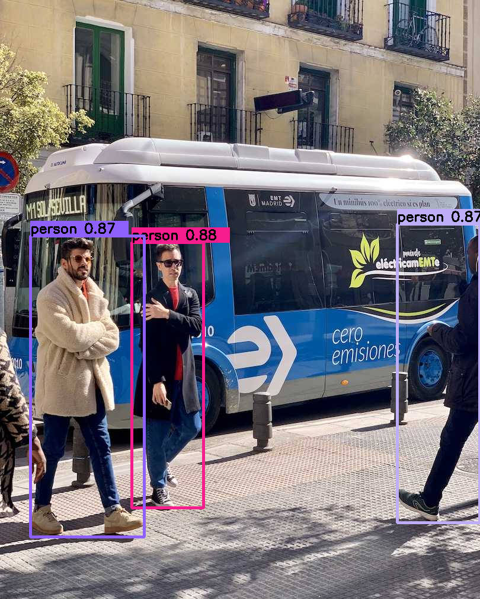
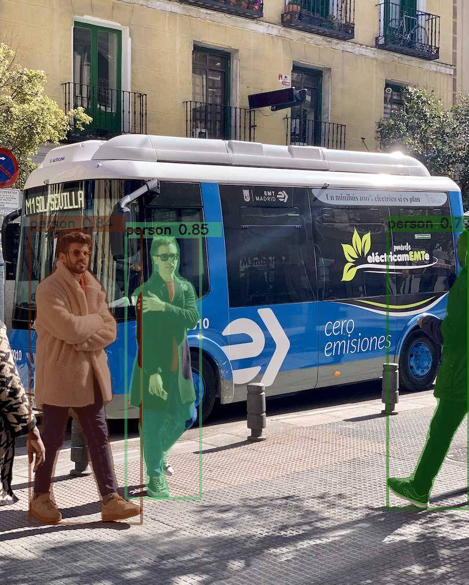

# yolo-onnxruntime-cpp
基于Onnxruntime的Yolo模型部署，无监督模型部署
支持检测、分割、分类、关键点检测、无监督模型

## 环境
- Opencv 4.x
- Onnxruntime 1.9
- CUDA 12.5
- OS: windows11 x64（x86不支持CUDA）

## 配置
需要配置好opencv和onnxruntime环境

## 使用说明
以检测模型为例：
```cpp
DetectTest(){
    DCSP_CORE* yoloDetector = new DCSP_CORE;
    yoloDetector->classes = { "person" }; 
    DL_INIT_PARAM params;
    params.ModelPath = "./models/yolov8n.onnx";
    params.rectConfidenceThreshold = 0.5;
    params.iouThreshold = 0.5;
    params.imgSize = { 640, 640 };
    params.modelType = YOLO_DETECT;

    ...

    yoloDetector->CreateSession(params);
    Detector(yoloDetector);
}
```


1. 指定模型检测类别：yoloDetector->classes = { "person" };写几个就检测几个。例如检测模型类别0表示"person"，类别1表示"bicycle", 类别2表示"car"...大括号里面只写"person"，其他检测类别就会被过滤；大括号里面写两个字符串，就会只检测前两个。
2. 指定模型路径：params.ModelPath
3. 具体图片路径需要在Detector()中设置


## 运行
在`main(){}`中，选择自己需要的模式，运行 `源.cpp`即可，自动检测GPU，没有GPU默认使用CPU
```cpp
main(){
...
    //DetectTest();  // 检测
    //ClsTest();  // 分类
    SegmentTest();  //分割
    //KeypointTest();  // 关键点检测
    //UnsuperviedTest();  //无监督
...
}
```

## 效果
<p align="center">
  <a href="result_img/result_det.jpg"></a>
</p>
<p align="center">
  <a href="result_img/result_seg.jpg"></a>
</p>
